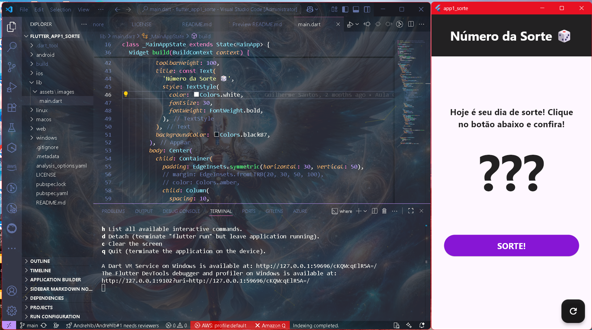

# 🎲 app1_sorte

Sorteador de números da sorte! Um app Flutter simples, moderno e divertido para sortear números aleatórios de 1 a 10, com interface intuitiva e alertas para números repetidos.

## Funcionalidades Originais
- Sorteia números aleatórios de 1 a 10
- Exibe alerta se o número já foi sorteado
- Mostra lista dos números já sorteados
- Botão para reiniciar sorteio
- Interface responsiva e estilizada

## Funcionalidades Adicionadas
Este projeto está em evolução! Novas funcionalidades serão implementadas uma a uma:

1. Personalizar o intervalo do sorteio (ex: 1 a 100)
2. Adicionar animações ou efeitos visuais
3. Salvar histórico dos sorteios
4. Compartilhar o número sorteado
5. Temas de cores ou modo escuro
6. Sons ao sortear

Cada funcionalidade será documentada aqui conforme for implementada.

## Veja o app em ação!

> Experimente sua sorte! Clique no botão e descubra seu número premiado!

## Como rodar o projeto

1. Instale o [Flutter](https://flutter.dev/docs/get-started/install)
2. Clone este repositório:
   ```bash
   git clone https://github.com/seu-usuario/flutter_app1_sorte.git
   ```
3. Instale as dependências:
   ```bash
   flutter pub get
   ```
4. Execute o app:
   ```bash
   flutter run
   ```

## Licença
Este projeto está licenciado sob a [MIT License](LICENSE).

## Autor
- André Luiz Barbosa ([Andrehlb](https://github.com/Andrehlb))

## Agradecimentos
- Professor Guilherme ([guileals](https://github.com/guileals))

---
